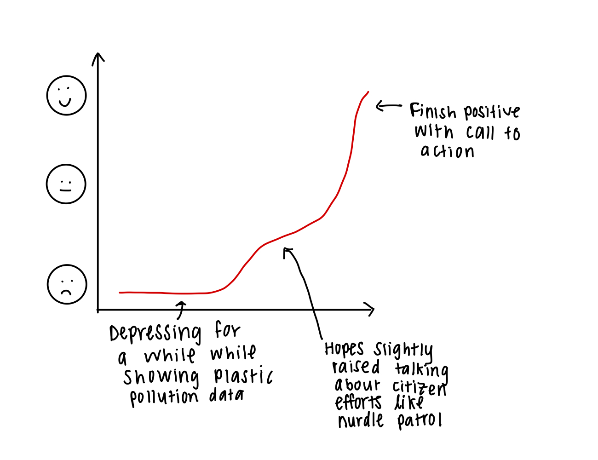
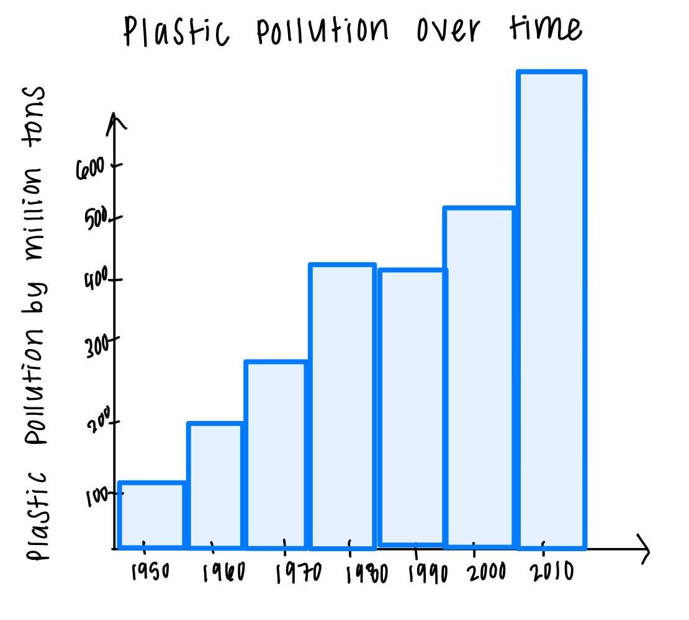

## Final Project, Part 1

#### High-level summary ✅
For my final project, I am interested in exploring plastic pollution and usage around the world. Specifically, I want to focus in on microplastics. Microplastics are plastic debris or particles that are less than five millimeters in length (about the size of a sesame seed). Data and awareness on microplastics and their impact on climate change is a fairly new phenonmenon, but it is estimated that the majority of plastic debris in lakes and oceans is in the form of microplastics (1). 

Nurdles are a specific type of microplastic I want to draw attention to. Nurdles are pre-production plastic pellets that are the building blocks for almost all of our plastic products (2). Nurdles are melted into everyday plastic products like water bottles, containers, jugs, etc. They are released into the environment during transport to plastic plants or factories, as their small size allows for little bits to spill undetected. They are mistaken for food by marine life and are toxic upon consumption. An estimated 230,000 tons of nurdles end up in our oceans every year (3). 

*Source: Unsplash*

#### Data Sources 📈
Because microplastic research is still relatively new and emerging, public data sources on microsplastics are few and far between. I thus plan to use publicly available data on plastic pollution globally. I found a dataset on global plastic production on [Kaggle](https://www.kaggle.com/datasets/sohamgade/plastic-datasets). The data shows global plastic production (in million tons) per year spanning from 1950 to 2010. It also includes data broken down by country and per capita plastic waste. 

For data on microplastics and nurdles, I plan to use what is available from the [Nurdle Patrol](https://nurdlepatrol.org/). This is a relatively new group that asks citizens to go out nurdle collecting/cleaning and report where they found the nurdles and how many were collected. The data is displayed on a map, which will require some web scraping to gather. 

#### Rough Outline and Sketches ✏️
Below is a rough story arc of how I will walk my audience through my presentation. The bulk of the beginning and middle of my overview will be pretty depressing. Most data on plastic pollution shows just how badly polluted our environment and oceans are. Once I introduce citizen efforts to gather more data and draw attention to microplastics (like the nurdle patrol), this will raise spirits slightly. Finally, my call to action will leave people feeling hopeful and like they can do something to address the problem. My call to action will be to go nurdle hunting for those that live near the ocean or a great lake, or holding corporations accountable to using more eco-friendly alternatives to plastic. 

I then plan to display bar graphs showing the rise of plastic pollution over the decades. Below is a rough sketch of what I had in mind for this (please note this data is not exact or accurate, this is just an initial sketch): 

I also plan to make use of Tableau's mapping data feature for displaying per capita plastic usage by country. I used the same color (blue) and used lighter shades to represent areas with less plastic pollution per capita and darker shades to show areas with the most plastic pollution per capita. The below example from flourish is using the same dataset I plan to use, but I will likely tweak things like the color scheme and population bubbles in my final. 

#### Method and medium 🌟
I plan to use shorthand as the final medium to present my project. I will build my visualizations in flourish and then embed those into shorthand. Because my data on microplastics is more incomplete, I will make use of pull out quotes and statistics in shorthand to convey the emerging issues over microplastic pollution.

#### References:
1. US Department of Commerce, National Oceanic and Atmospheric Administration. n.d. “What Are Microplastics?” Accessed November 23, 2022. https://oceanservice.noaa.gov/facts/microplastics.html.

2. “What’s a Nurdle?” n.d. Accessed November 23, 2022. https://carnegiemnh.org/whats-a-nurdle/.

3. McVeigh, Karen. 2021. “Nurdles: The Worst Toxic Waste You’ve Probably Never Heard of.” The Guardian, November 29, 2021, sec. Environment. https://www.theguardian.com/environment/2021/nov/29/nurdles-plastic-pellets-environmental-ocean-spills-toxic-waste-not-classified-hazardous.
