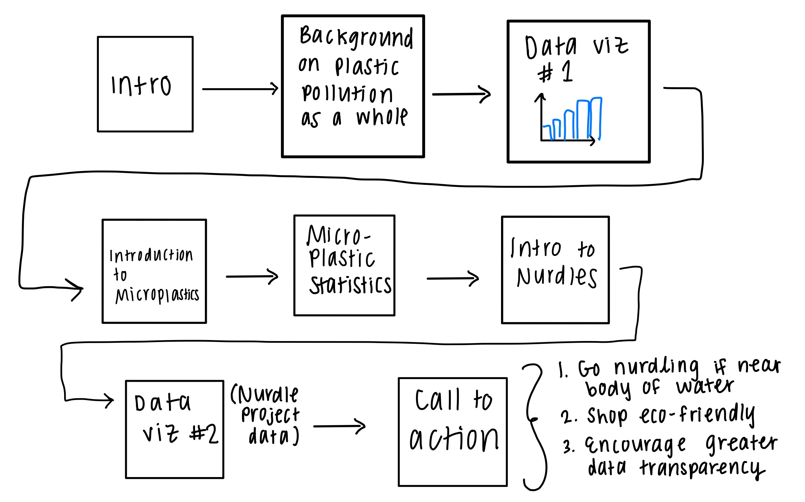

# Final Project, Part 2
For this part of my final project, I put together a wireframe detailing the order of my presentation, transferred that into a rough draft on shorthand (storyboard), and conducted interviews as part of user research. 

### Wireframe🕸️
Below is the sketch of my initial wireframe. The first data visualization is one of the sketches from the [first part of the final project](https://megan0422.github.io/Megan-Hussey-Portfolio/finalproject1) (world plastic production from 1950-2015). I decided to not use the world map as my second data visualization, as I feel that it does not encompass a shock factor. Truly, it doesn't matter how much plastic each country produces for the purposes of my presentation. 

### Storyboard📖

### Interviews👩‍💻
As part of my user research, I presented my storyboard to three individuals and gathered their responses to the following questions: 

1. What are your initial takeaways? 
2.	What struck your eye? 
3.	Was there anything that confused you?
4.	Would you do anything differently?
5.	Who do you think is the target audience and would it reach them well?
6.	How was the use of imagery?

To ensure I interviewed a diverse set of perspectives, I spoke to two individuals in their 20s and one individual in their 50s. Their responses to these questions are documented in the table below. 

| Question | Person 1 (female, 24 years) | Person 2 (female, 58 years)
| --- | ----------- | ----------- |
| Initial takeaways | It makes me feel bad about the pollution of plastic in the ocean and the ways I contribute. The 90% statistics were especially alarming. | I already knew quite a bit about plastic and recycling plastic but my initial thoughts are that we need to use less plastic, however, the petroleum lobby is really the problem. They created the myth of recycling. |
| Things that struck your eye | The big bar graph about the growth of plastic production since the 1950s. It has been very continuous. | The graph that shows the exponential growth of plastic production. | 
| Things you found confusing | Nothing was super confusing but you didn’t focus on nurdles until the end. Are all nurdles microplastics or are all microplastics nurdles? The transition needs to be clarified. | Why is so little plastic recycled? Is it because people don’t try? Or can most plastic not be recycled? That needs to be clarified. |
| Things you would do differently | Could you visualize some of your statistics instead of just spelling them out for the audience? It was a little hard to follow all the words so quickly. | I would put in a picture of nurdles. I think I’m having trouble understanding what they are still. Maybe include a dimension. |
| Target audience | People who care about the environment, with a sub focus on people who have time and money to care about the environment. I do think it reaches them well. | Anybody that cares about the environment. I think it would resonate with them well. |
| Use of imagery | I thought your use of imagery was incredibly powerful. | In general, it was good. But I am still left wondering what a nurdle really looks like. |

