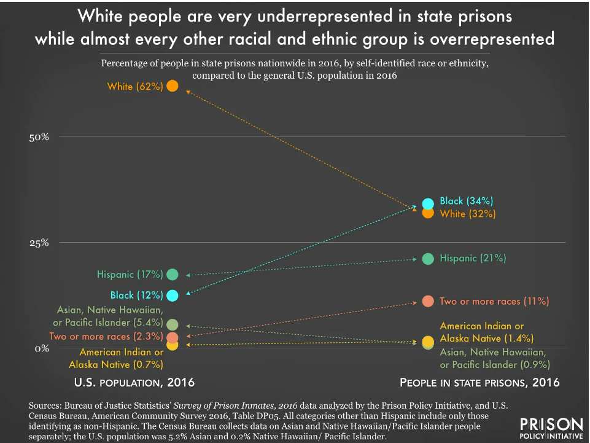
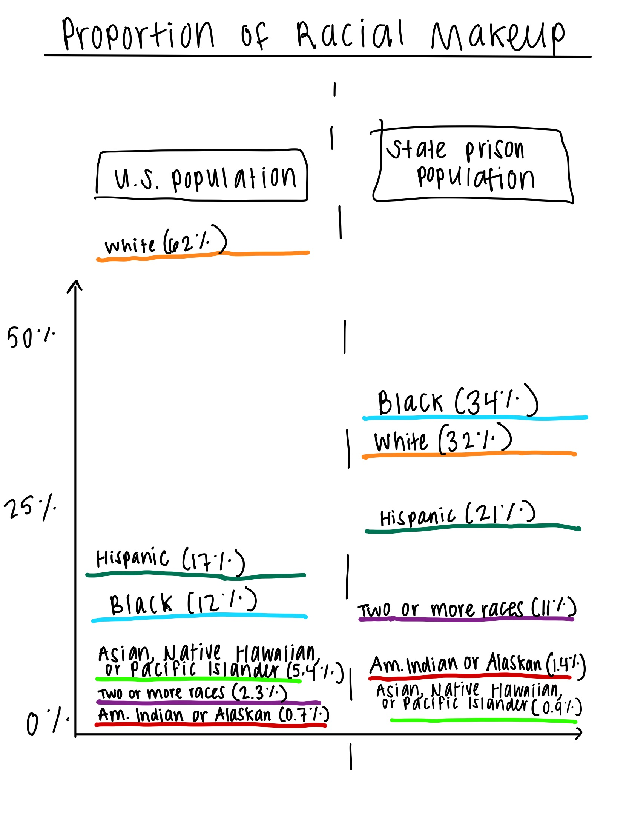
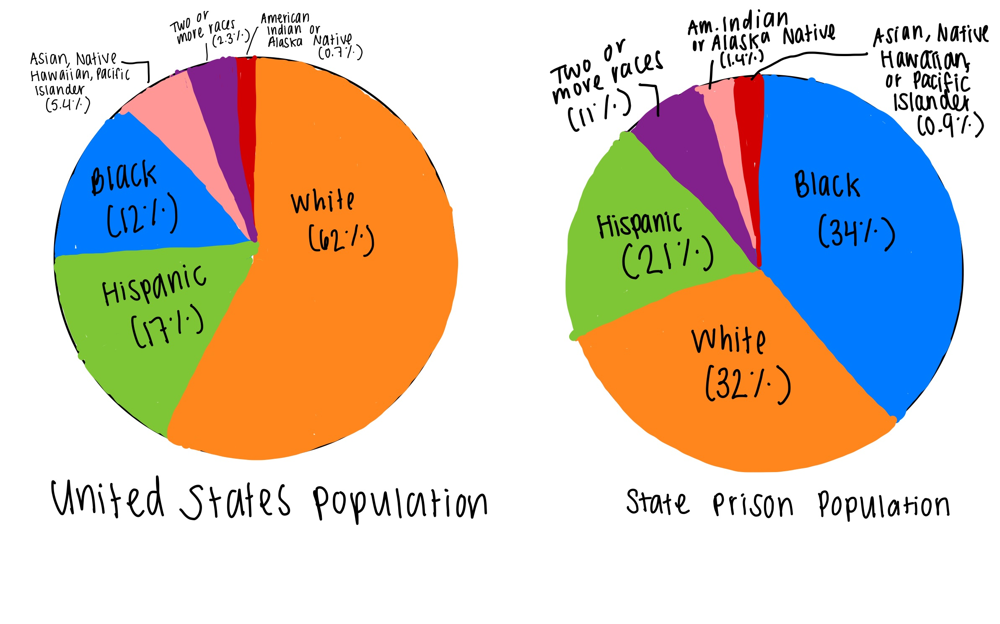

## Assignment: Critique by Design

#### Choosing the visualization
For this assignment, I was tasked to first critique an existing visualization and then offer up a redesign solution. I chose to critique and redesign the following visualization from the Prison Policy Initiative on state prison populations by racial demographic. 

[Source: Prison Policy Initiative](https://www.prisonpolicy.org/reports/beyondthecount.html)

I chose this visualization because I believe this tells an incredibly important story - that people of color are overrepresented in U.S. state prisons relative to their proportion of the United States population. However, I think the way the visual depicts this message is confusing and takes time for the viewer to fully grasp. 

### Critiquing the visualization
My overall critiques of this visual were that it was very difficult to comprehend at first glance and took some processing to grasp the message. The labels at the bottom of each side of the graph were especially confusing, because I didn't know right away what the dots on both sides represented.  The long title works well to remedy this, because it helps the viewer to understand the message of the visualization right away to give them purpose while deciphering it. However, with more effective uses of color and scaling, I don't believe a long title would be necessary to aid in understanding. 

### New wireframes and feedback loop
I first attempted to recreate a similar version to the original visualization, using lines instead of circles to make the categories a little bit easier to track across both the U.S. population side and the state prison population side. I also moved the titles to the top to make it easier for the reader to initially see what they two separate sides represented. 

**User feedback on first wireframe**
I spoke to two mid-twenty graduate students (1M and 1F) who both could interpret what my sketch was trying to convey after a few minutes of sitting with it. Both expressed similar confusion that I had about the difference of the two sides - they were unclear if each side added up to 100% separately or individually. That planted the idea for me to try two separate pie charts, to make it clear for the viewer that while we are comparing the two population proportions by racial breakdown, they should *separately* add up to 100%, not together.

The second wireframe I drew up was thus the two separate pie charts. I found this task to be deceptively simple, but after thinking about my own struggles to make sense of the two separate population counts on the inital visual, I decided to give it a go. 

**User feedback on second wireframe**
I got feedback from 3 other classmates on the pie charts, who suggested that if I was truly trying to just tell the story that White people are disproportionately underrepresented in state prison population counts relative to their overall population total when compared to Black people and other minorities, that I should just color White vs. Black or White vs. Black and one other racial cateogry (perhaps Hispanic). This led to me to the final design.

### Final redesign
I decided to use two pie charts to show the different population breakdowns, and after hearing feedback from the second group, decided to only color three of the pie slices to really emphasize the message. I originally only added two colors (Black and White populations) but felt that the Hispanic population in state prisons was also a good indicator of disproportionate representation of people of color in prison relative to their overall population. 

I also attempted to make a stacked bar graph as my final design, but I ultimately felt like nothing showed how overwhelming the different representation was in state prison populations compared to the overall population more than the pie chart. Even though I still feel like pie charts are deceptively simple, I do agree that with the user feedback I was given that if we are trying to show proportions of 100%, they are the simplest way to break it down. 

